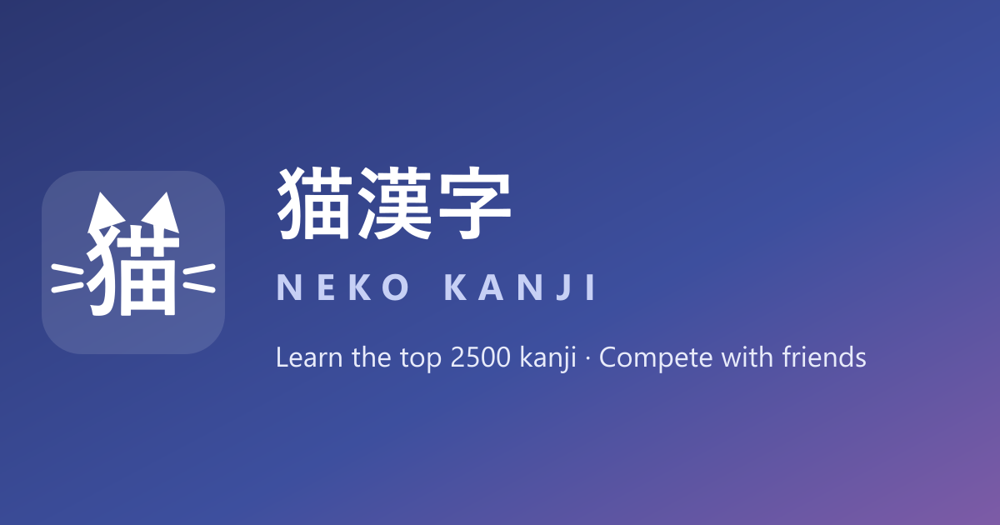

# 猫漢字 Neko Kanji

**Learn the top 2500 Japanese kanji — and race your friends while doing it.**

🔗 **Live:** [japanese-teacher-delta.vercel.app](https://japanese-teacher-delta.vercel.app)



## Features

### 🗾 Kanji Heatmap
A GitHub-contribution-style map of the **2500 most frequent kanji**, ordered by frequency. Every time you answer a kanji correctly in practice, its square levels up:

> ⬜ Not learned → 🟦 Blue (1+) → 🟩 Green (5+) → 🟪 Purple (10+) → 🟨 Gold (20+)

### 🎮 Gamification
- **XP & Levels** — every correct answer earns XP; levels come with Japanese titles: 🌱 見習い → 📖 学生 → ⚔️ 侍 → 🎓 先生 → 🏵 達人 → 🌸 仙人
- **Badges** — HackerRank-style hexagon badges for milestones (first kanji, 100/500/1000/2500 kanji, score goals, 7-day streak…)
- **Daily progress map** — a second heatmap showing your correct answers per day over the last 15 weeks

### 👥 Social
- **Profiles** — Twitter-style profile pages with custom avatar & wallpaper uploads, stats, badges and a recent-activity feed
- **Friends** — find users with the built-in search, send requests from their profile, compare progress and heatmaps
- **Groups** — create a group, invite friends with a 6-character code, and race other groups on a global leaderboard (group score = sum of member scores)

### 📚 Learning Tools
- **Learn** — hiragana & katakana charts + JLPT N5 kanji with example words and writing practice
- **Practice** — multiple-choice quizzes and random-character drills (wired into the kanji map)
- **Reading** — Japanese texts with a hover dictionary: reading, romaji and meaning for every word
- **Dictionary** — Jisho-powered word lookup
- **Unified search** — one search box in the header finds both users and kanji (by character or frequency rank)

### 🌏 Bilingual
Full Turkish / English UI toggle — including quiz answers, reading glosses and kanji meanings.

## Tech Stack

| Layer | Tech |
|---|---|
| Frontend | Next.js 15 (App Router), React 19 |
| Backend & DB | [Convex](https://convex.dev) (queries, mutations, file storage) |
| Auth | Convex Auth (email + password) |
| Hosting | Vercel (frontend) + Convex Cloud (backend) |
| Fonts | Nunito (UI) + Zen Maru Gothic (Japanese) via `next/font` |

## Getting Started

```bash
# 1. Install dependencies
npm install

# 2. Link a Convex deployment (creates .env.local)
npx convex dev --once

# 3. Seed the kanji table (2501 rows: { rank, char })
npx convex import --table kanji kanji-seed.jsonl

# 4. Set up Convex Auth keys on your deployment
npx @convex-dev/auth

# 5. Run
npm run dev          # Next.js on http://localhost:3000
npx convex dev       # Convex function watcher (separate terminal)
```

### Environment

`.env.local` (created by `npx convex dev`):

```
CONVEX_DEPLOYMENT=dev:<your-deployment>
NEXT_PUBLIC_CONVEX_URL=https://<your-deployment>.convex.cloud
```

On Vercel, set `NEXT_PUBLIC_CONVEX_URL` to your **prod** Convex URL and deploy functions with `npx convex deploy`.

## Project Structure

```
app/                # Next.js pages (learn, practice, read, dictionary,
│                   #   kanji, friends, groups, account, profile/[userId])
components/         # Nav, KanjiHeatmap, Logo, providers…
convex/             # schema + queries/mutations (kanji, progress, users,
│                   #   friends, groups, search) + Convex Auth setup
lib/                # i18n (TR/EN UI strings), en.js (content translations),
                    #   kana/kanji/word/text data, romaji, TTS helpers
```

---

がんばって！ 🐱
